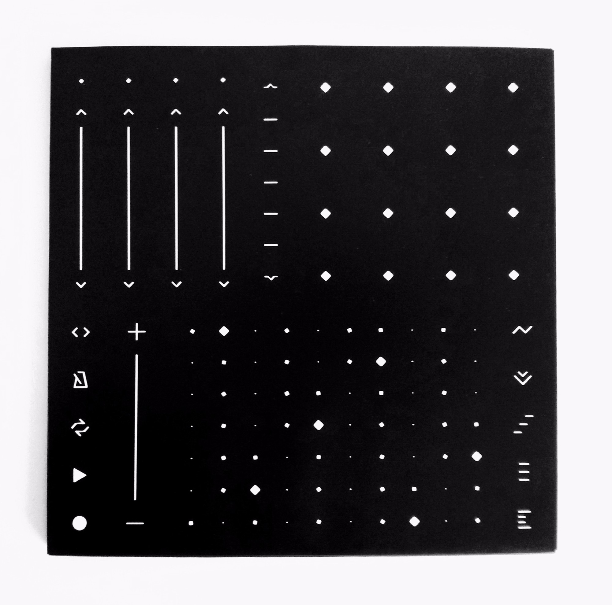
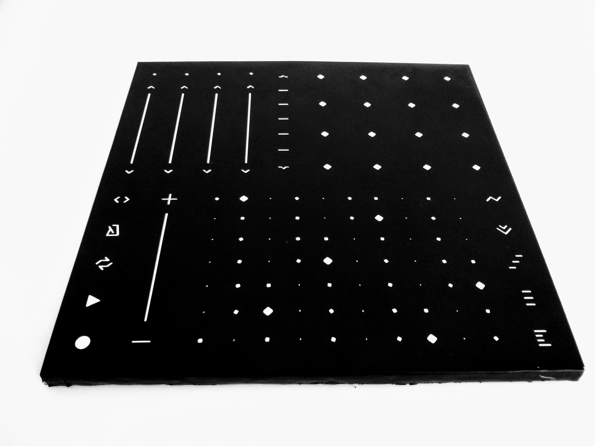
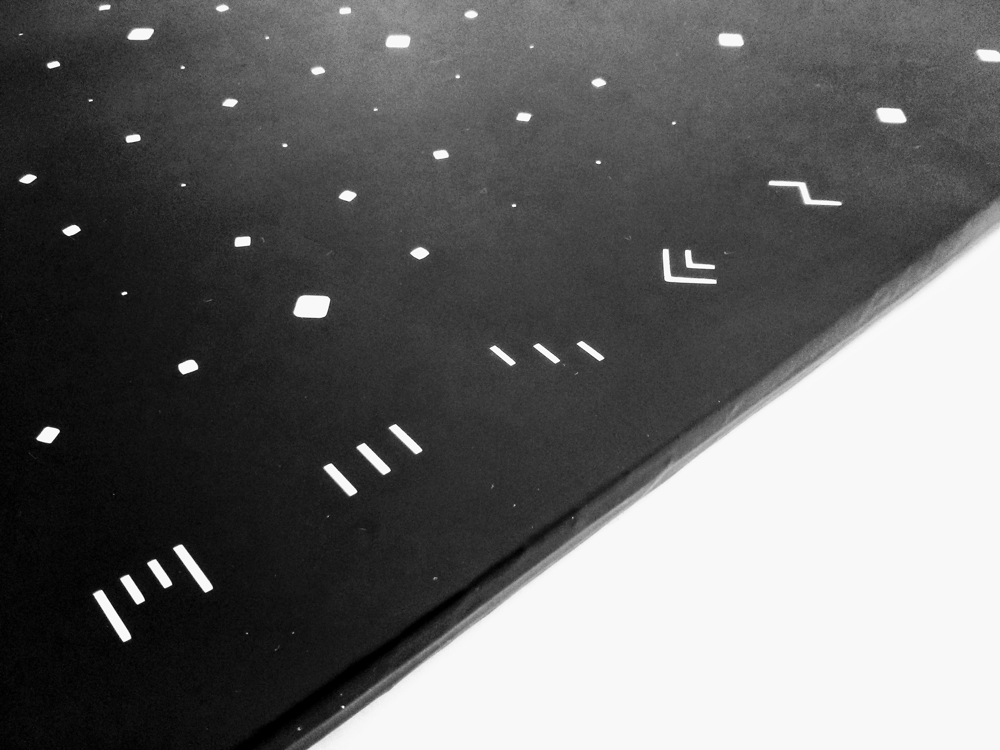
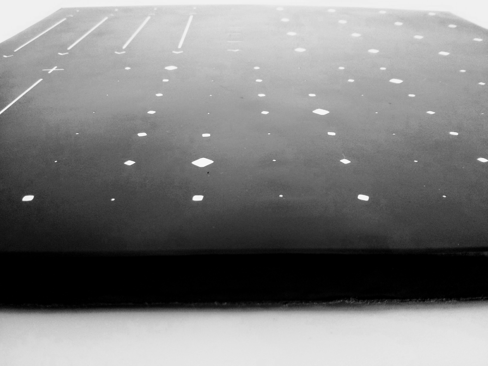
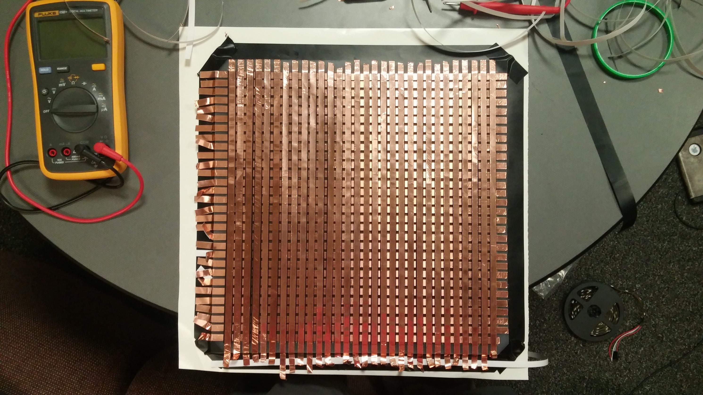
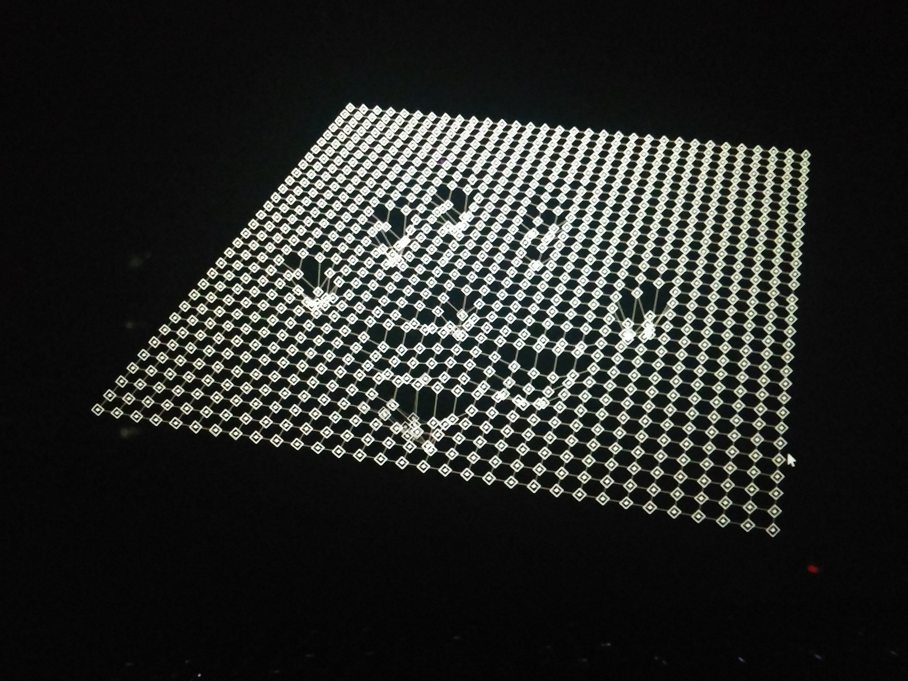
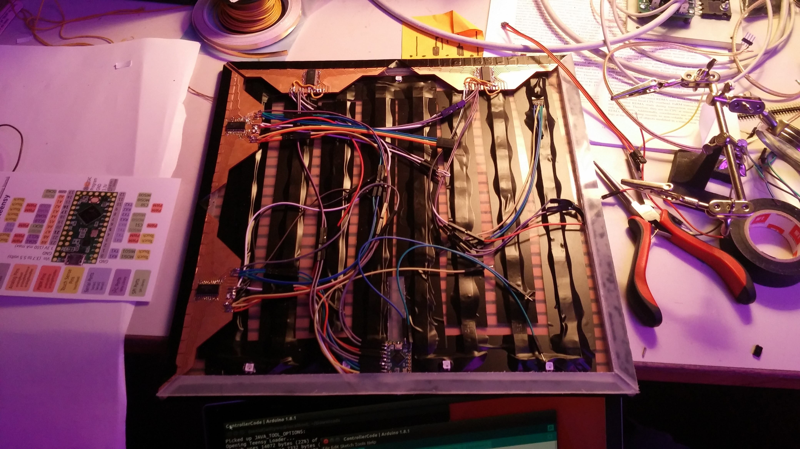
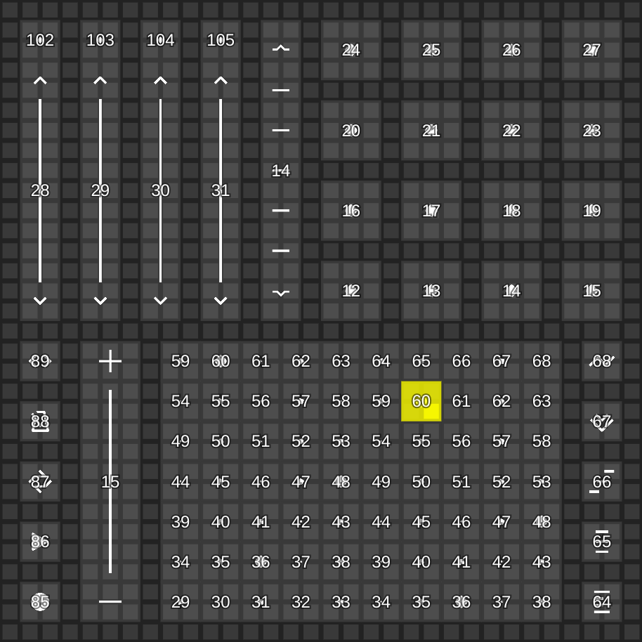

# E-Form

When I designed, prototyped, and built a [MIDI controller](https://github.com/willy-vvu/Mixer) last year, I thought 8 knobs and 8 faders would be fine. However, I quickly felt limited by its expressive power. Since then, I've been longing to produce another electronic music interface able to capture more of a musician's nuance through human touch, which is inherently multidimensional.

E-Form is an expressive multitouch music controller, sensitive to x/y position as well as pressure on its smooth surface. Thin and light, the controller is designed for music production as well as performance on-the-go. Using it, I produced a [few short songs](https://soundcloud.com/william-vvu/sets/balance).

---

## Behind the Scenes

Designing and building a performant, robust, MIDI spec-compliant, thin & light product is quite difficult, often requiring custom/homemade tools and components. Below are a few images showing some of the software and hardware processes used in construction.

*The pressure sensing layer: a grid of conductive foil and Velostat.*

*A visualation of my hand on the surface.*

The raw data from the sensing layer is quite a firehose when trying to visualize in real-time. Fortunately, I wrote an interactive Processing sketch to plot the pressure on each grid intersection right as it came off the microcontroller, which was immensely helpful for diagnosing the inevitable noise/wiring issues.

*Exposed wiring and homemade PCBs.*

*Software I made to edit and program the interface layout.*

Mapping pads to MIDI CC values in code was not a task I was willing to do by hand in code. Fortunately, I wrote a quick tool with an interface that allowed me to specify which regions of the controller corresponded to which MIDI messages. This mapping was then converted into lightly optimized C code which ran directly on the microcontroller.

### Specs

Dimensions: 300mm x 300mm x 12mm

Weight: About 500g

Touch Area: Edge-to-edge 300mm x 300mm

Touch Points: 1024

Touch Resolution: Sub-millimeter (computed)

Pressure Resolution: 1024 levels

Sample Rate: More than 60Hz

Haptics: Linear Resonant Actuator

Material cost: Less than $100

---

Supported by: [Council for the Arts at MIT](http://arts.mit.edu/welcome/camit/)

Learning Focus: PCB Design, PCB Milling, Vinyl Cutting, Surface Mount Soldering, Product Design, Integrated Circuits, Sensing Grids, Performance Interfaces, Music Production, Metaprogramming

Media: MIDI Controller, Physical Interface, Icon Design, Object

Software: C++, JavaScript, p5.js, Processing, Inkscape, Bitwig Studio, Fab Modules

Hardware: PCB Mill, Vinyl Cutter, Soldering Iron, Bandsaw, Teensy

Date: June 2017
